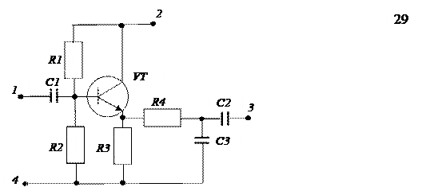
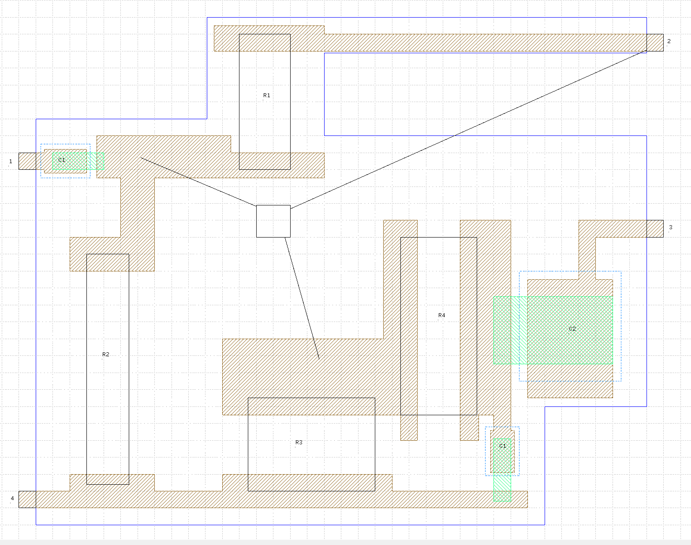

```{r setup, include=F}
knitr::opts_chunk$set(echo = TRUE)
options(scipen=999)

cat_fine_approx_seq <- function(lbl_l, lbl_r, lbl_unit, fine_seq, approx_seq, tag=0) {
  cat("$$")
  for (i in seq_along(fine_seq)) {
    if (paste(fine_seq[[i]]) != paste(approx_seq[[i]])) {
      if (tag == 1){
        cat(paste(lbl_l, i, lbl_r, fine_seq[[i]]," \\text см", " \\approx ", approx_seq[[i]], lbl_unit, sep=""))
      }
      else {
      cat(paste(lbl_l, i, lbl_r, fine_seq[[i]], " \\approx ", approx_seq[[i]], lbl_unit, sep=""))
      }
        }
    else {
      cat(paste(lbl_l, i, lbl_r, approx_seq[[i]], lbl_unit, sep=""))
    }
    if (i < length(fine_seq)) {
      cat(",")
    }
  }
  cat("$$")
}

```

# Вариант 29 (1)

## Исходные данные

 

Параметры элементов:

-   $R1$: 20 кОм ±10% 0,01 Вт
-   $R2$: 47 кОм ±20% 0,02 Вт
-   $R3$: 4.7 кОм ±10% 0,02 Вт
-   $R4$: 2 кОм ±10% 0,02 Вт
-   $C1$: 1000 пФ
-   $C2$: 330 пФ
-   $C3$: 1000 пФ

## Расчет параметров ГИС

### 1. Расчет размеров пленочных резисторов

Опеределим оптимальное удельное поверхностное сопротивление:

```{r, include=F}
R_R <- c(20*10^3, 47*10^3, 4.7*10^3, 2*10^3)
R_W <- c(0.01, 0.02, 0.02, 0.02)
R_delta = c(10,20,10,10)
R_rho_sq_fine <- round(sqrt(sum(R_R) / sum(1 / R_R)))
R_rho_sq <- signif(R_rho_sq_fine, digits=1)
```

$$\rho_□ = \sqrt{\frac{\sum R}{\sum R^{-1}}} = `r R_rho_sq_fine` \text{Ом} \approx `r R_rho_sq` \text{Ом}$$

Материал с ближайшим значением $\rho_□$, удовлетворяющий необходимому диапазону значений сопротивления — *Кермет К-50С* с удельной мощностью рассеивания $W_0 = 2$ Вт/см\^2.

Определим ширину резисторов $b_w$, обеспечивающую необходимую мощность рассеивания:

$$b_w = \sqrt{\frac{\rho_□ \cdot W}{R \cdot W_0}}$$

(Значения округляются в большую сторону до шага сетки $H = 0.1$ мм)

```{r, echo=F, results='asis'}
R_W_0 = 2
R_b_w_fine <- round(sqrt((R_rho_sq * R_W) / (R_R * R_W_0)), 3)
R_b_w <- round(R_b_w_fine*10 + 0.05, 1) # round up

cat_fine_approx_seq("b_{w", "}=", "\\text{мм}", R_b_w_fine, R_b_w, tag=1)
```

Определим ширину резисторов $b$ с поправкой на точность изготовления:

```{r, echo=F, results='asis'}
R_b_prec = ifelse(R_delta == 10, 0.3, 0.2)
R_b <- pmax(R_b_w, R_b_prec)

cat_fine_approx_seq("b_", "=", "\\text{мм}", R_b, R_b)
```

Определим длины резисторов:

$$l = \frac{R}{\rho_□}\cdot b = k_ф \cdot b$$

(Значения округляются до ближайшего, кратного шагу сетки $H = 0.1$ мм)

```{r, echo=F, results='asis'}
R_k_shape = R_R / R_rho_sq
R_l_fine = R_k_shape * R_b
R_l = round(R_l_fine, 1)

cat_fine_approx_seq("k_{ф", "}=", "", R_k_shape, R_k_shape)
cat_fine_approx_seq("l_", "=", "\\text{мм}", R_l_fine, R_l)
```

Оценим погрешность, вызванную округлением:

$$\Delta R' = \frac{\|R - R'\|}{R}\cdot 100\%,\ R' = \frac{l\cdot\rho_□}{b}$$

```{r, echo=F, results='asis'}
R_R_real = (R_l*R_rho_sq) / R_b
R_dR = round((abs(R_R - R_R_real) / R_R) * 100)

cat_fine_approx_seq("\\Delta R'_", "=", "\\%", R_dR, R_dR)
```

Для каждого из резисторов погрешность удовлетворяет условию $\Delta R' \leq \Delta R$.

### 2. Расчет размеров пленочных конденсаторов

Расчет сводится к определению активной площади конденсаторов:

$$S = \frac{C}{C_0}$$

Для минимизации размеров найдем $C_{min}$, взяв $S_0 = 0.25$ мм\^2 (минимально возможную площадь):

$$C_{min} = min(\frac{C_i}{S_0})$$

```{r, echo=F, results='asis'}
C_C <- c(1000, 300, 1000) # pF
C_0_fine = C_C / 25
cat_fine_approx_seq("C_{min_", "}=", "\\text{пФ/см^2 * 10^3}", C_0_fine, C_0_fine)
```

Наиболее подходящим материалом диэлектрика является *моноокись германия*, поскольку оно обладает высокой удельной емкостью $C_0 = 15 * 10^3$ пФ/см\^2.

Рассчитаем площадь конденсаторов с выбранным материалом:

```{r, echo=F, results='asis'}
C_0 <- 150
C_S_fine = C_C / C_0
cat_fine_approx_seq("S_", "=", "\\text{мм^2}", C_S_fine, C_S_fine)
```

### 3. Конструирование пленочных межсоединений и контактных площадок

Контактные площадки изготавливаются из алюминия А99.

### 4. Проектирование защитного слоя

Защитный слой может быть изготовлен из любой диэлектрической пленки, за исключением пятиокиси тантала.

## Итоговая схема
 
